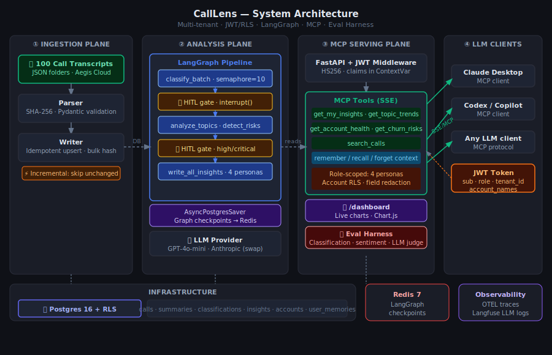
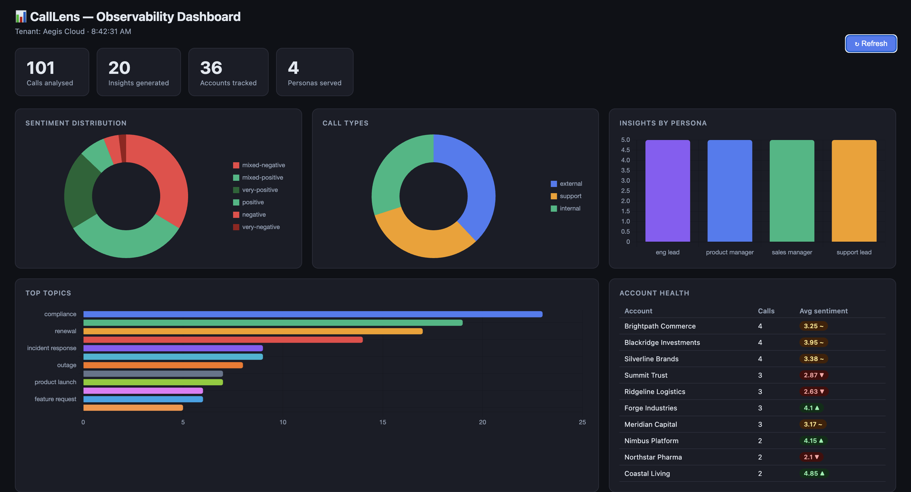

# CallLens

**Production-grade AI engineer portfolio project.**  
Multi-tenant B2B call analytics platform that exposes cross-call intelligence via an MCP server — so any LLM client (Claude Desktop, Codex, Copilot) can answer identity-aware questions about your customer calls.



---

## What it does

100 real B2B SaaS call transcripts → LangGraph analysis pipeline → Postgres (with RLS) → MCP server → role-aware answers in any LLM.

Ask Claude Desktop *"Which accounts are at churn risk this quarter?"* as a sales manager and get a different answer than a support lead asking the same question — same data, different framing, different authorization.

---

## Key engineering features

| Feature | Implementation |
|---|---|
| **Multi-tenancy** | Postgres Row-Level Security; `SET app.tenant_id` per connection |
| **Identity-aware MCP** | JWT claims (role + account_names) thread through ContextVar into every tool |
| **LangGraph pipeline** | 6-node graph with 2 HITL interrupt gates; `AsyncPostgresSaver` checkpointing |
| **Idempotent ingestion** | SHA-256 content hash per call folder; single bulk hash query; skip-on-match |
| **Persistent memory** | `remember_context` / `recall_context` / `forget_context` tools per JWT sub |
| **Eval harness** | Rule-based oracle + LLM-as-judge; regression guard with baseline JSON |
| **Observability** | OTEL tracing (FastAPI + pipeline nodes); Langfuse LLM call logging; structlog JSON |
| **Live dashboard** | `/dashboard` — Chart.js charts pulling real-time data from Postgres |

---

## Architecture

```
┌─────────────────┐   ┌──────────────────────┐   ┌─────────────────────┐
│  ① INGESTION    │   │   ② ANALYSIS PLANE   │   │  ③ MCP SERVING      │
│                 │   │                      │   │                     │
│  100 transcripts│──▶│  LangGraph pipeline  │──▶│  FastAPI + JWT      │
│  Parser (SHA256)│   │  ├─ classify_batch   │   │  MCP Tools (SSE)    │
│  Idempotent     │   │  ├─ 🛑 HITL gate     │   │  Role-scoped tools  │
│  upsert         │   │  ├─ analyze_topics   │   │  Postgres RLS       │
│                 │   │  ├─ detect_risks     │   │  /dashboard         │
│                 │   │  ├─ 🛑 HITL gate     │   │                     │
└─────────────────┘   │  └─ write_insights   │   └──────────┬──────────┘
                      └──────────────────────┘              │ SSE/MCP
                                                            ▼
                                               Claude Desktop · Codex · Copilot
```

---

## MCP tools

| Tool | Roles | What it returns |
|---|---|---|
| `get_my_insights` | all | Persona-specific insights (support, sales, product, eng) |
| `get_topic_trends` | all | Top topics ranked by frequency + avg sentiment |
| `get_account_health` | all except eng_lead | Account stats; financials redacted unless sales_manager |
| `get_churn_risks` | sales_manager only | High-risk accounts from the AI analysis |
| `search_calls` | all | Keyword search across summaries; call types filtered by role |
| `remember_context` | all | Save a memory keyed to your JWT sub |
| `recall_context` | all | Retrieve your last N memories across sessions |
| `forget_context` | all | Delete a specific memory (own only) |

### Role permission matrix

```
                     get_my  topic  account  churn  search  memory
support_lead           ✓      ✓       ✓        ✗      ✓       ✓
sales_manager          ✓      ✓       ✓        ✓      ✓       ✓
product_manager        ✓      ✓       ✓        ✗      ✓       ✓
eng_lead               ✓      ✓       ✗        ✗      ✓       ✓
```

`get_account_health` additionally redacts `contract_value`, `renewal_date`, `arr`, `csm_owner` for non-sales roles.

---

## Observability dashboard

Live at **`http://localhost:8001/dashboard`** when the MCP container is running.



Metrics endpoint: **`GET /api/metrics`** — JSON, no auth required.

Charts included:
- Sentiment distribution (donut) — 6-level taxonomy: very-negative → very-positive
- Call type breakdown (donut) — external / support / internal
- Top topics (horizontal bar) — ranked by call frequency
- Insights by persona (bar) — 4 personas
- Account health table — avg sentiment score per account with risk badges

---

## Eval harness

```bash
make eval           # accuracy + coverage gate — free, DB queries only
make eval-judge     # LLM-as-judge quality gate — uses API credits
make eval-reset     # clear baseline for a fresh run
```

Current baseline metrics (Aegis Cloud dataset, 100 calls):

| Metric | Score | Threshold |
|---|---|---|
| Classification accuracy | 100% | ≥ 75% |
| Sentiment direction accuracy | 64% | ≥ 60% |
| Insight type coverage | 100% | 100% |

The baseline is saved to `tests/evals/baseline_metrics.json` on first run. Subsequent runs fail if any metric regresses more than 5%.

---

## Quick start

### Prerequisites
- Docker + Docker Compose
- `OPENAI_API_KEY` (or Anthropic key)

### 1 — Configure

```bash
cp .env.example .env
# Edit .env: set OPENAI_API_KEY
```

### 2 — Start infrastructure

```bash
docker compose up -d postgres redis
```

### 3 — Ingest transcripts

```bash
docker compose run --rm --entrypoint calllens-ingest app
# Output: New: 100 / Updated: 0 / Skipped: 0 / Errors: 0
```

### 4 — Run the analysis pipeline

```bash
make pipeline-run
# Runs all 6 LangGraph nodes; pauses at HITL gates if any uncertain calls
```

### 5 — Start the MCP server

```bash
make mcp-up
# Server at http://localhost:8001
# Dashboard at http://localhost:8001/dashboard
```

### 6 — Generate test tokens

```bash
make mcp-token
# Prints JWT tokens for all 4 personas
```

### 7 — Connect Claude Desktop

Add to `claude_desktop_config.json`:

```json
{
  "mcpServers": {
    "calllens": {
      "url": "http://localhost:8001/mcp/sse",
      "headers": {
        "Authorization": "Bearer <your_sales_manager_token>"
      }
    }
  }
}
```

Then ask: *"Which accounts are at churn risk? What actions should I take this week?"*

---

## Project structure

```
calllens/
├── src/calllens/
│   ├── ingestion/        # Parser, writer, idempotent CLI
│   ├── agents/           # LangGraph graph, nodes, prompts, state
│   ├── mcp/              # FastMCP server, JWT auth, tools, dashboard
│   ├── eval/             # Metrics oracle, LLM-as-judge
│   ├── observability/    # OTEL setup, structlog
│   └── llm/              # Provider factory with Langfuse callback
├── tests/
│   ├── unit/             # Parser tests
│   ├── integration/      # DB ingestion tests
│   └── evals/            # Accuracy gate, LLM judge, regression guard
├── migrations/           # Postgres schema with RLS policies
├── docs/
│   └── architecture.svg
└── docker-compose.yml
```

---

## Makefile reference

```bash
make up               # Start Postgres + Redis
make ingest           # Run ingestion CLI
make pipeline-run     # Run the full LangGraph pipeline
make pipeline-review  # Review a specific batch BATCH_ID=...
make mcp-up           # Start MCP server on :8001
make mcp-token        # Generate JWT tokens for all personas
make eval             # Run the accuracy eval suite
make eval-judge       # Run LLM-as-judge quality eval
make smoke            # Quick DB sanity check
make psql             # Open Postgres shell
```

---

## Environment variables

| Variable | Required | Description |
|---|---|---|
| `OPENAI_API_KEY` | Yes | LLM provider key |
| `JWT_SECRET` | Yes (prod) | HS256 signing secret |
| `LANGFUSE_PUBLIC_KEY` | No | LLM observability (cloud.langfuse.com) |
| `LANGFUSE_SECRET_KEY` | No | LLM observability |
| `OTEL_EXPORTER_OTLP_ENDPOINT` | No | OTLP endpoint (e.g. Jaeger) |
| `LLM_PROVIDER` | No | `openai` (default) or `anthropic` |
| `LLM_MODEL` | No | `gpt-4o-mini` (default) |

---

## Design decisions

**Why Postgres + RLS instead of a vector DB?**  
The 100-call dataset fits entirely in Postgres. Adding a vector DB adds ops cost without meaningful recall improvement at this scale. Semantic search can be layered on with pgvector when needed.

**Why LangGraph instead of a simple loop?**  
HITL (human-in-the-loop) interrupt gates are the hard part. LangGraph's `interrupt()` + `AsyncPostgresSaver` gives durable, resumable checkpoints — the pipeline can pause, wait for human corrections, and resume without re-running completed nodes.

**Why MCP instead of a REST API?**  
MCP makes the analytics available to any LLM client without building a custom chat UI. The role-scoped tools and RLS-enforced DB queries mean the LLM gets only what the authenticated user is allowed to see.

**Why JWT ContextVar instead of passing claims as arguments?**  
MCP tools have fixed signatures defined by the server. Threading claims through function arguments would pollute every tool signature. ContextVar gives clean per-request scoping in async code without changing the tool interface.
